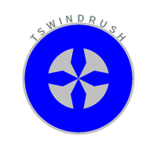
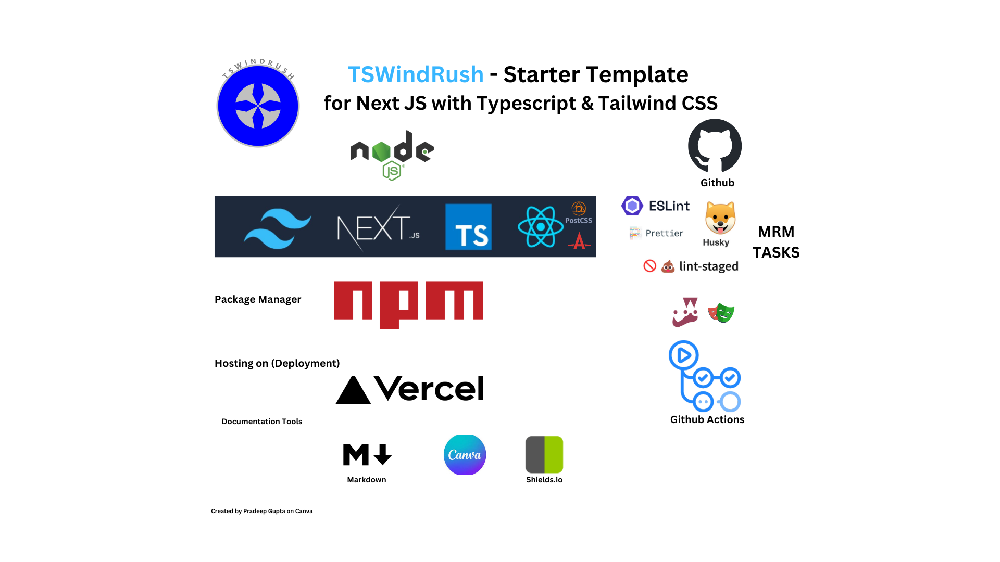

# TSWindrush Starter Template

<div align="center">
   
   <h1 align="center">TSWindrush Starter Template</h1> 
   <h2 align="center"><u>Kickstart your modern web development journey effortlessly!</u>></h2> 
</div>

<div align="center">
  
</div>

> **High-performance Next.js Starter Template** Accelerate your projects with the power of **TypeScript**, **Tailwind CSS**, and **Next.js** in one seamless setup.

---

<div align="center">
  <a href="https://www.npmjs.com/package/next"></a>
  <a href="https://www.npmjs.com/package/react"></a>
  <a href="https://www.npmjs.com/package/typescript"></a>
   <a href="https://www.npmjs.com/package/tailwindcss"></a>
  </div>
 
 ---
 
 <div align="center">
   <a href="https://tsw-ind-rush.vercel.app/"></a>
   <a href="https://github.com/pradeepngupta/tswindrush/actions/workflows/ci.yml"></a>
   <a href="https://app.codecov.io/github/pradeepngupta/tswindrush"></a>
   <a href="https://github.com/pradeepngupta/tswindrush"></a>
    <a href="https://github.com/pradeepngupta/tswindrush"></a>

</div>

🚀 TSWindRush is a blazing-fast, developer-friendly starter template combining Next.js, TypeScript, and TailwindCSS for modern web development.

Next JS is the Powerful React Framework for building Web Applications. Together with TypeScript, it provides a great developer experience and a scalable architecture. And with Tailwind CSS, you can create beautiful and responsive web applications.

## 📚 Table of Contents

- [TSWindrush Starter Template](#tswindrush-starter-template)
  - [📚 Table of Contents](#-table-of-contents)
  - [🎯 Why This Template?](#-why-this-template)
  - [Why Choose TSWindRush?](#why-choose-tswindrush)
  - [✔️ Prerequisites](#️-prerequisites)
  - [🌟 Features](#-features)
  - [🚀 Live Demo](#-live-demo)
  - [🛠️ Setup \& Installation](#️-setup--installation)
  - [⚡ Usage](#-usage)
  - [⚡Usage Scenarios](#usage-scenarios)
  - [🔗 Additional Documentation](#-additional-documentation)
  - [🛠️ Contribution](#️-contribution)
  - [🌟 Support](#-support)
  - [Contributors 🌟](#contributors-)
  - [Join the Conversation 💬](#join-the-conversation-)
  - [🔗 Connect](#-connect)
  - [🚀 Roadmap](#-roadmap)
    - [Current Planned Features](#current-planned-features)
    - [Proposed Features](#proposed-features)
    - [Community Wishlist](#community-wishlist)
  - [Code of Conduct 🤝](#code-of-conduct-)
  - [📄 License](#-license)

## 🎯 Why This Template?

This starter template is designed to kickstart your Next.js projects with:

- **TypeScript** for robust and scalable development.
- **TailwindCSS** for fast and customizable styling.
- A pre-configured setup for **Jest** and **Playwright** for testing.
- A pre-configured **ESLint** & **Prettier** to make the code readable.
- Out of the box pre-commit and pre-push hooks using **Husky**.
- Out-of-the-box **GitHub Actions** for CI/CD workflows.

Whether you're building a personal project, SaaS platform, or landing page, this template provides all the essentials to get started quickly and efficiently.

Read more [here](./docs/TechStack.md) on Why I choose the above Tech Stack

## Why Choose TSWindRush?

- 🚀 **Blazing Fast Builds**: Optimized Next.js configuration for speedy development.
- 🎨 **Effortless Styling**: Tailwind CSS setup for consistent, scalable design.
- 🛡️ **Reliable Codebase**: TypeScript ensures type safety for production-ready code.

## ✔️ Prerequisites

Before you start using Next JS, make sure you have the following prerequisites:

- Node.js and npm installed on your system.
- Basic knowledge of React and JavaScript.
- Basic understanding of HTML, CSS, and JavaScript.
- Basic understanding of TypeScript.
- Basic understanding of Tailwind CSS.

## 🌟 Features

- ✅ **Next.js** : The React framework for production.
- ✅ **TypeScript** : Type safety and better developer experience.
- ✅ **TailwindCSS** : Utility-first CSS framework for rapid styling.
- ✅ **ESLint & Prettier** : For clean, consistent code.
- ✅ **Jest & Playwright** : Testing tools for quality assurance.
- ✅ **GitHub Actions** : Pre-configured workflows for building, testing, and deploying.

## 🚀 Live Demo

This starter template is deployed on Vercel. Hee is the Demo: 

For Live Demo, Click below link to the deployed app

- [Vercel App](https://tsw-ind-rush-pradeepnguptas-projects.vercel.app/)
- [API Route - Hello](https://tsw-ind-rush-pradeepnguptas-projects.vercel.app/api/hello)
- [API Route - Version](https://tsw-ind-rush-pradeepnguptas-projects.vercel.app/api/version)

This project is pre-configured with the deployment on Vercel. For detailed instructions, refer to the [DEPLOYMENT](./docs/DEPLOYMENT.md).

## 🛠️ Setup & Installation

Follow these steps to get started:

1. Clone this repository:
   ```bash
   git clone https://github.com/pradeepngupta/nextjs-typescript-tailwindcss.git
   ```
2. Navigate to the project directory:
   ```bash
   cd TSWindRush
   ```
3. Install dependencies:
   ```bash
   npm install
   ```
4. Run the development server:
   ```bash
   npm run dev
   ```
5. Open [http://localhost:3000]() in your browser to see the app.

For the detailed instruction, you can refer [here](./docs/NextJS_Default.md).

## ⚡ Usage

- **Fork the Repo**: Fork the Github Repo
- **Build**: Build the project

  ```
  npm install
  npm run build
  ```

- **Create Vercel Account**: Create your own Vercel Account, and deploy

  ```
  vercel login
  vercel
  ```

- **Testing** : Run Jest and Playwright tests using

  ```
  npm test
  npm run test:e2e
  ```

- **GITHUB Secrets**: Define the below secrets in your Github Repo Settings: <VERCEL_PROJECT_ID>, <VERCEL_ORG_ID>, <VERCEL_TOKEN>
- **Customization** : Modify `tailwind.config.js` and `globals.css` to customize your styling.
- **TypeScript** : Add or edit `.ts` and `.tsx` files for your components.

## ⚡Usage Scenarios

- Kickstarting modern web applications with a pre-configured setup.
- Prototyping UI / UX designs with Tailwind CSS & TypeScript
- Learning or teaching Next.js, TypeScript, and Tailwind CSS in combinations.

## 🔗 Additional Documentation

For detailed information about various integrations and configurations, refer to the[ Integration &amp; Configuration Guide.](./docs/INTEGRATION.md)

## 🛠️ Contribution

🙌 Contributions are welcome! If you'd like to add new features, support additional technologies, or improve this template, here’s how:

1. Fork the repository.
2. Create a new branch:
   ```bash
   git checkout -b feature/your-feature-name
   ```
3. Commit your changes:
   ```bash
   git commit -m "Add feature description"
   ```
4. Push your changes:
   ```bash
   git push origin feature/your-feature-name
   ```
5. Create a pull request.

Check out [more](./docs/CONTRIBUTING.md) for guidelines.

## 🌟 Support

If you find this project useful:

- 🌟 Star the repository to show your support.
- 📢 Share it with others to spread the word.
- 💬 Have feedback or ideas? Open an issue or create a pull request!

---

## Contributors 🌟

Thanks to these amazing people for their contributions: `<a href="https://github.com/pradeepngupta/tswindrush/graphs/contributors">` `` `</a>`

---

## Join the Conversation 💬

Have questions, feedback, or feature requests? Join the discussions here: 👉 [GitHub Discussions](https://github.com/pradeepngupta/tswindrush/discussions)

## 🔗 Connect

- [GitHub Issues](https://github.com/pradeepngupta/nextjs-typescript-tailwindcss/issues): Report bugs or suggest features.
- [Contribute](https://github.com/pradeepngupta/nextjs-typescript-tailwindcss): Collaborate to make this template even better.

Let’s build something amazing together! 🚀

---

## 🚀 Roadmap

### Current Planned Features

- Example pages: Landing Page, Dashboard, Error Page, Blog Page.
- Template for `create-next-app` CLI.
- Organized config files in a `config/` folder.
- UI themes: dark, light, system.
- Performance tools: Web Vitals and Lighthouse CI.
- SEO optimization using `next-seo`.

### Proposed Features

- Authentication with NextAuth.js.
- PWA features (offline support, service workers).
- Prebuilt Tailwind components for faster UI development.

### Community Wishlist

Help shape the future of **TSWindRush**! Suggest features or vote on existing ones by opening an issue on [GitHub](https://github.com/pradeepngupta/tswindrush/issues).

Some ideas already proposed:

- Accessibility improvements (a11y).
- Internationalization (i18n) support.
- GraphQL integration with Apollo Client.
- Mock API integration.
- Dockerize the application for containerized deployment.

---

## Code of Conduct 🤝

We value a welcoming and inclusive community. Please read our [Code of Conduct](./CODE_OF_CONDUCT.md).

## 📄 License

This project is licensed under the [MIT License](./LICENSE).
