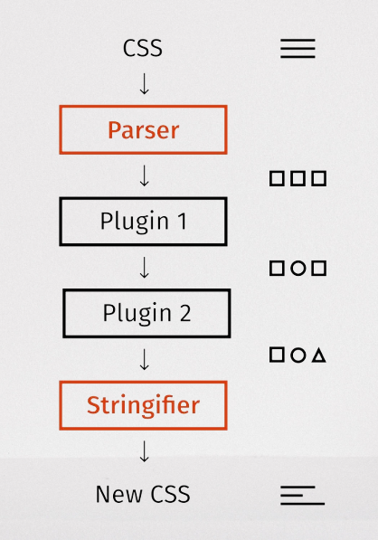

- [Tech Stack](#tech-stack)
  - [Development](#development)
    - [Next.js](#nextjs)
    - [TypeScript](#typescript)
    - [Tailwind CSS](#tailwind-css)
      - [PostCSS \& Auto-Prefixer](#postcss--auto-prefixer)
  - [Deployment \& Hosting](#deployment--hosting)
    - [Vercel](#vercel)
    - [Github Pages](#github-pages)
  - [Continuous Integration / Continuous Deployment](#continuous-integration--continuous-deployment)
    - [Github Actions](#github-actions)
  - [Static Code Analysis](#static-code-analysis)
    - [Eslint](#eslint)
  - [Code Formatter](#code-formatter)
    - [Prettier](#prettier)
  - [Package Manager](#package-manager)
    - [npm](#npm)
  - [Git Hooks](#git-hooks)
    - [Husky](#husky)
  - [Testing](#testing)
  - [Jest](#jest)
    - [React Testing Library (RTL)](#react-testing-library-rtl)
  - [CodeCov](#codecov)
  - [Playwright](#playwright)
  - [Storybook](#storybook)

# Tech Stack

## Development

### Next.js

We love React. React has made UI development accessible in ways we never imagined before. It also can lead developers down some rough paths.

Next.js offers a lightly opinionated, heavily optimized approach to creating applications using React.

From routing to API definitions to image rendering, we trust Next.js to lead developers toward good decisions.

Next JS provides the following features:

    - Server-side Rendering (SSR)

    - Static File Serving

    - Automatic Code Splitting

    - Hot Module Reloading (HMR)

    - Built-in TypeScript Support for static typing

    - Built-in CSS Support

    - Built-in Image Optimization

    - Built-in Internationalization (i18n) Support

    - Built-in Routing

    - Built-in API Support

    - Built-in Data Fetching

    - Built-in Styling Support (Tailwind CSS)

    - Built-in Testing Support (Jest, Enzyme)

    - Built-in Code Linting Support (ESLint, Prettier)

    - Built-in Bundling and Minification Support (Webpack)

    - Built-in Deployment Support (Vercel, Netlify)

### TypeScript

JavaScript is hard. Why add more rules?

We firmly believe the experience TypeScript provides will help you be a better developer.

It provides live feedback as you write your code by defining expected data types, and either provides helpful autocomplete in your editor or yells at you with red squiggly lines if you’re trying to access a property that doesn’t exist or trying to pass a value of the wrong type, which you would otherwise have to debug further down the line.

Whether you’re new to web development or a seasoned pro, the “strictness” of TypeScript will provide a less frustrating, more consistent experience than vanilla JS.

Typesafety makes you faster. If you’re not convinced, you [might be using TypeScript wrong…↗](https://www.youtube.com/watch?v=RmGHnYUqQ4k)

### Tailwind CSS

Tailwind CSS is a tiny, [utility first↗](https://tailwindcss.com/docs/utility-first) CSS framework for building custom designs, without the context switching that regular CSS requires. It is purely a CSS framework and does not provide any pre-built components or logic, and provides [a very different set of benefits↗](https://www.youtube.com/watch?v=CQuTF-bkOgc) compared to a component library like Material UI.

Tailwind feels like “zen-mode CSS”.

By providing building blocks in the form of good default colors, spacing, and other primitives, Tailwind makes it easy to create a good-looking app. And unlike component libraries, it does not hold you back when you want to take your app to the next level and create something beautiful and unique.

Additionally, with its inline-like approach, Tailwind encourages you to style without worrying about naming classes, organizing files, or any other issue not directly tied to the problem you’re trying to solve.

#### PostCSS & Auto-Prefixer

When using **Tailwind CSS**, **PostCSS** acts as the core engine to process your styles, while **Autoprefixer**, a PostCSS plugin, automatically adds necessary vendor prefixes to your generated CSS, ensuring compatibility across different browsers without you needing to manually add them; essentially, Tailwind leverages PostCSS's flexibility to enhance its functionality and streamline the development process by handling browser compatibility through Autoprefixer.

**PostCSS** is a tool for transforming styles with JS plugins. These plugins can lint your CSS, support variables and mixins, transpile future CSS syntax, inline images, and more.

PostCSS is used by industry leaders including Wikipedia, Twitter, Alibaba, and JetBrains. The [Autoprefixer](https://github.com/postcss/autoprefixer) and [Stylelint](https://stylelint.io/) PostCSS plugins is one of the most popular CSS tools.

PostCSS takes a CSS file and provides an API to analyze and modify its rules (by transforming them into an [Abstract Syntax Tree](https://en.wikipedia.org/wiki/Abstract_syntax_tree)). This API can then be used by [plugins](https://github.com/postcss/postcss#plugins) to do a lot of useful things, e.g., to find errors automatically, or to insert vendor prefixes.

**Autoprefixer**, (is a PostCSS Plugin) allows you to write your CSS rules without vendor prefixes (in fact, you can forget about them entirely).

This PostCSS plugin for parsing CSS and adding vendor prefixes as needed is one of the most popular frontend build libraries. It’s been recommended by Google and is used by Twitter and Alibaba.

Key points about using PostCSS and Autoprefixer with Tailwind:

- **Tailwind as a PostCSS plugin:**

  Tailwind CSS is designed to work as a plugin within the PostCSS ecosystem, allowing you to easily integrate it with other PostCSS features and plugins like Autoprefixer.

- **Vendor prefixing:**

  Since Tailwind itself doesn't automatically add vendor prefixes, using Autoprefixer ensures your generated styles work correctly across different browsers.

- **Streamlined workflow:**

  By combining Tailwind with PostCSS and Autoprefixer, you can write clean CSS without worrying about browser compatibility issues.

## Deployment & Hosting

### Vercel

**Vercel is the native Next.js platform, designed to enhance the Next.js experience.**

[Next.js](https://nextjs.org/) is a fullstack React framework for the web, maintained by Vercel.

While Next.js works when self-hosting, deploying to Vercel is zero-configuration and provides additional enhancements for **scalability, availability, and performance globally**.

Vercel supports [popular frontend frameworks](https://vercel.com/docs/frameworks) out-of-the-box, and its scalable, secure infrastructure is globally distributed to serve content from data centers near your users for optimal speeds.

### Github Pages

GitHub Pages are public webpages hosted and published through GitHub.

Github Pages are quick to showcase open source stativ web application.

## Continuous Integration / Continuous Deployment

### Github Actions

GitHub Actions is one of the popular continuous integration and continuous delivery (CI/CD) platform that allows us to automate our build, test, and deployment pipeline.

And It is having seamless integration with GitHub

## Static Code Analysis

### Eslint

**Eslint** is a popular static code analysis tool that checks your code for errors and enforces coding standards.

Why would you use ESLint to check TypeScript code when the TypeScript compiler already performs some code quality checks?

Well, the TypeScript compiler is capable of carrying out a few code quality checks. ESLint is capable of carrying out many more [checks](https://github.com/typescript-eslint/typescript-eslint/tree/master/packages/eslint-plugin).

## Code Formatter

### Prettier

Building & enforcing a code - style guide.

Prettier is an opinionated code formatter with support for multiple languages.

It removes all original styling[\*](https://prettier.io/docs/en/#footnotes) and ensures that all outputted code conforms to a consistent style.

Why Only Prettier?

Prettier is the only “style guide” that is fully automatic.

## Package Manager

### npm

[npm](https://www.npmjs.com/) is a package manager for Node.js with hundreds of thousands of packages.

npm provides automated dependency and package management.

## Git Hooks

### Husky

Husky is widely used for Git hooks because

1. It simplifies the process of setting up and managing these automated scripts,
2. allowing developers to easily enforce code quality checks like linting and testing before committing or pushing code,
3. essentially preventing poor quality code from entering the repository,
4. all without needing to manually configure complex Git hook configurations within the `.git` directory.

Husky provides a straightforward way to define Git hooks within your project's `package.json` file, eliminating the need to manually edit the hidden `.git` directory.

By running scripts like linters and tests before committing, Husky helps maintain consistent code style and catch potential issues early on.

Since everyone on the project is using the same set of pre-commit hooks, it ensures that all code adheres to the established standards.

Husky seamlessly integrates with popular tools like ESLint, Prettier, and Jest, allowing you to leverage their functionality within your Git hooks.

## Testing

Testing is the most important in the software developement.

TDD is the practice almost all developers are following.

**What are the different type of Tests?**

- **Unit Testing**
  - Tests one unit of code at a time. May be a single function or a component without depending on other units
- **Integration Testing**
  - Tests how multiple units work together. Testing interaction between different functions/units/components
- **Functional / Behavioural Testing**
  - Functional testing means testing the behaviour of a function/software. We might be testing if the software does the right thing with the particular set of data. That might be an integration test as it might have to interact with different units. So the functional test can be an integration test as well
  - The functional test can also be a simple unit test. Let's say on a button click, the div turns red. This might be a simple unit test but still it can also be considered as a functional test as it tests for a particular behaviour of CLICK TURNS RED OR NOT
  - So, the functional test means, not testing the code but testing the behaviour. **React-Testing-Library** encourages functional tests
- **Acceptance/End-to-End(E2E) test**
  - This is an End-to-End testing where we need a browser and might also need the server
  - Popular tools for E2E testing are **[Cypress](https://www.cypress.io/), [Selenium](https://www.selenium.dev/) and [Playwright](https://playwright.dev/)**
    - Cypress supports only Javascript
    - Selenium supports all popular languages like Java, Python, Ruby, C#, Php, etc.
    - Playwright supports TypeScript, JavaScript, Python, .NET, and Java
    - [Check - Cypress Vs Selenium Vs Playwright](https://www.lambdatest.com/blog/playwright-vs-selenium-vs-cypress/)
  - **React-Testing-Library doesn't support E2E testing**

## Jest

Jest is a JavaScript testing framework designed to ensure correctness of any JavaScript codebase.

It allows you to write tests with an approachable, familiar and feature-rich API that gives you results quickly.

**Jest makes testing delightful.**

**Jest is primarily considered a unit testing framework for Javascript projects.**

Jest can also be used for Integration Testing and functional testing.

In order to perform functional testing, React testing library needs to use to render React Components in virtual DOM.

Some developers can use it to perform end-to-end (E2E) testing by integrating it with tools like Puppeteer.

But I am restricting myself, atleast in this boilerplate code to use JEST for unit testing and Playwright for E2E Testing.

### React Testing Library (RTL)

The `React Testing Library` is a very light-weight solution for testing React components.

It provides light utility functions on top of `react-dom` and `react-dom/test-utils`, in a way that encourages better testing practices.

Its primary guiding principle is:

> [The more your tests resemble the way your software is used, the more confidence they can give you.](https://testing-library.com/docs/guiding-principles)

So rather than dealing with instances of rendered React components, your tests will work with actual DOM nodes.

This library encourages your applications to be more accessible and allows you to get your tests closer to using your components the way a user will, which allows your tests to give you more confidence that your application will work when a real user uses it.

> This library is a replacement for [Enzyme](http://airbnb.io/enzyme/).

## CodeCov

## Playwright

Playwright is an open-source automation framework for end-to-end testing. It supports most modern rendering browsers, including Firefox, Chromium, and Webkit. Playwright is created and maintained by Microsoft and has steadily been gaining in popularity.

It is a Node library that automates the Chromium, WebKit, and Firefox browsers using a single API. It enables quick, efficient, competent, and reliable cross-browser c.

Playwright test framework supports Jest, Mocha, Jasmine, and other prominent CI servers using a single API. Playwright offers cross-language support, which includes TypeScript, JavaScript, Python, .NET, and Java.

## Storybook
